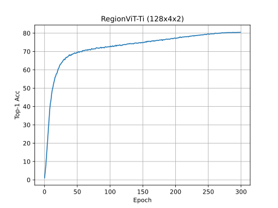

# Region ViT

This repo is the pytorch implementation of ["RegionViT: Regional-to-Local Attention for Vision Transformers"](https://arxiv.org/pdf/2106.02689.pdf) by Chun-Fu Chen, Rameswar Panda, Quanfu Fan.

The code is implemented based on [Microsoft/Swin-Transformer](https://github.com/microsoft/Swin-Transformer).

This is **NOT** the official repository of RegionViT. At the moment in time the official code of the authors 
is not available yet but can be found later at: [https://github.com/IBM/RegionViT](https://github.com/IBM/RegionViT).

## Getting Started
This repo only contain the implementation of the RegionViT for image classification.

Since the implementation is largely based on [Microsoft/Swin-Transformer](https://github.com/microsoft/Swin-Transformer) 
and the code structure is well maintained. You can refer to [this doc](https://github.com/microsoft/Swin-Transformer/blob/main/get_started.md).

Just change the config file to `configs/regionvit/{Ti/S/M/B}.yaml` for RegionViT.

For example, to train a `RegionViT-Ti` on ImageNet from scratch, run:
```bash
python -m torch.distributed.launch --nproc_per_node <num-of-gpus-to-use> --master_port 12345  main.py \ 
--cfg configs/regionvit/regionvit_tiny.yaml --data-path <imagenet-path> [--batch-size <batch-size-per-gpu> --output <output-directory> --tag <job-tag>]
```

The details of model config can be found in Table 2 of the paper.

## Results
### RegionViT-Ti
Train on two 4xV100 Machines with batch size 128 (actually 128x4x2) and 20 warmup epochs (same to Swin-Transformer), can reach 80.504% top-1 accuracy (80.4% reported in paper).



## Some Issues
1. The instance repetition haven't been implemented (Table 11 in paper).
2. `RegionViT-{}+` haven't been implemented due to the limited details.

## Citing RegionViT
```
@article{chen2021regionvit,
  title={RegionViT: Regional-to-Local Attention for Vision Transformers},
  author={Chen, Chun-Fu and Panda, Rameswar and Fan, Quanfu},
  journal={arXiv preprint arXiv:2106.02689},
  year={2021}
}
```

## Acknowledgements
Repo [Microsoft/Swin-Transformer](https://github.com/microsoft/Swin-Transformer) really helps a lot when implement the code.

